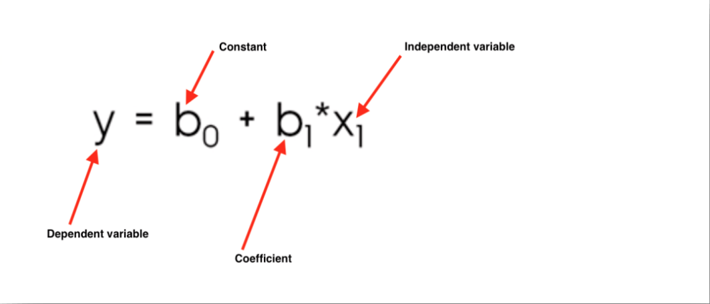
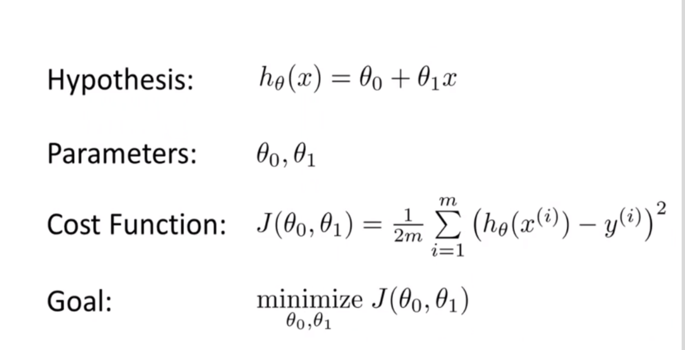

# Lecture 1 : Intro

## What is machine learning ?
is a form of artificial intelligence (AI) that teaches computers to
think in a similar way to how humans do: Learning and
improving upon past experiences. It works by exploring data
and identifying patterns, and involves minimal human
intervention
### Supervised learning
In Supervised Learning, a machine is trained using 'labeled' data
Datasets are said to be labeled when they contain both input and
output parameters. In other words, the data has already been
tagged with the correct answer

### two types of supervised learning :

#### regression

#### classification

### Unsupervised learning
uses machine learning algorithms to analyze and cluster unlabeled
datasets. These algorithms discover hidden patterns or data
groupings without the need for human intervention .

### reinforcement learning 
is a type of machine learning technique that enables an agent
to learn in an interactive environment by trial and error using
feedback from its own actions and experiences

#### clustring 

# Linear regression

## Pearson correlation coefficient 
Measures the statistical association between two continuous
variable

